<p align="center">
  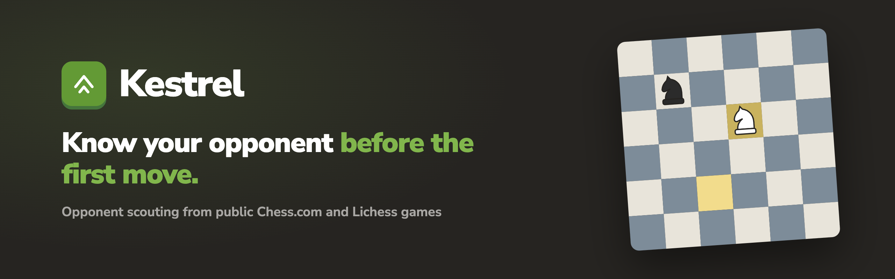
</p>

<p align="center">
  <a href="https://github.com/Charliejamesfletcher/kestrel/actions/workflows/ci.yml"></a>
  
  
  
  
</p>

<p align="center">
  <b>Kestrel scouts chess opponents from their public Chess.com and Lichess games.</b><br>
  Openings, replies to 1.e4 and 1.d4, clock habits, endgame results, form and a one-line game plan.<br>
  For tournament players, league teams and club captains. Preparation only, never during a game.
</p>

---

<p align="center">
  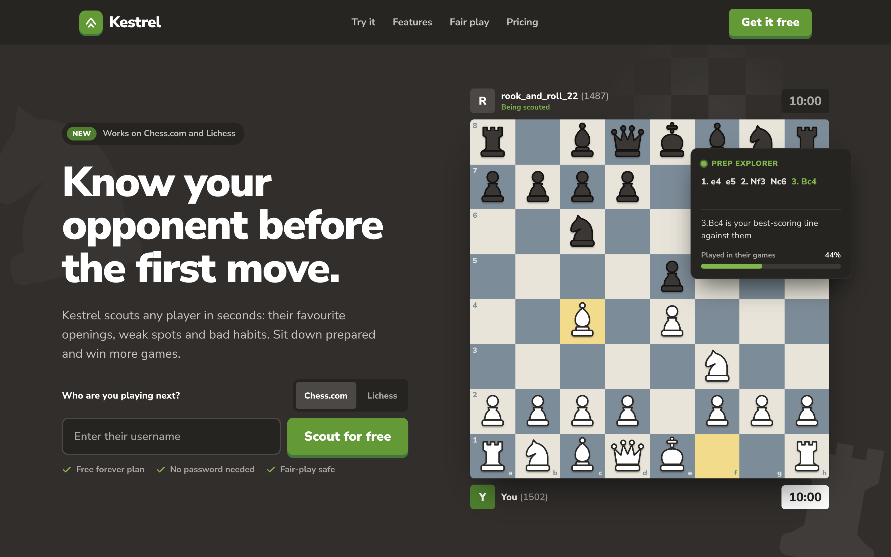
</p>

## What you get

Type a username and Kestrel downloads their recent public games, then builds a report in a couple of milliseconds. Every number shows how many games it came from, and a section with too little data says so instead of guessing.

<p align="center">
  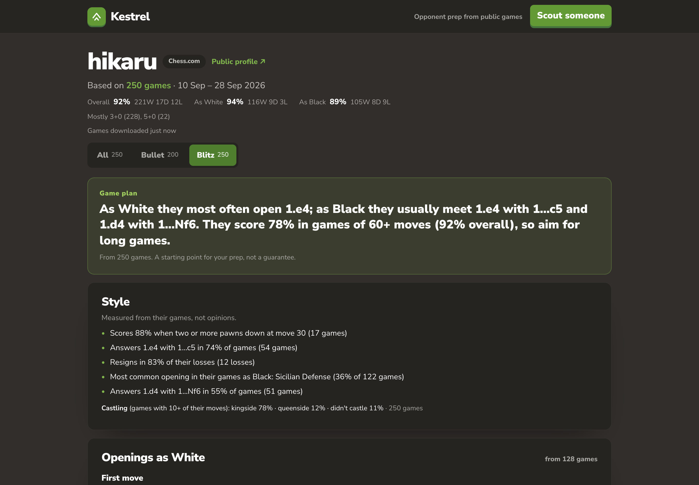
</p>

<table>
  <tr>
    <td width="50%" valign="top">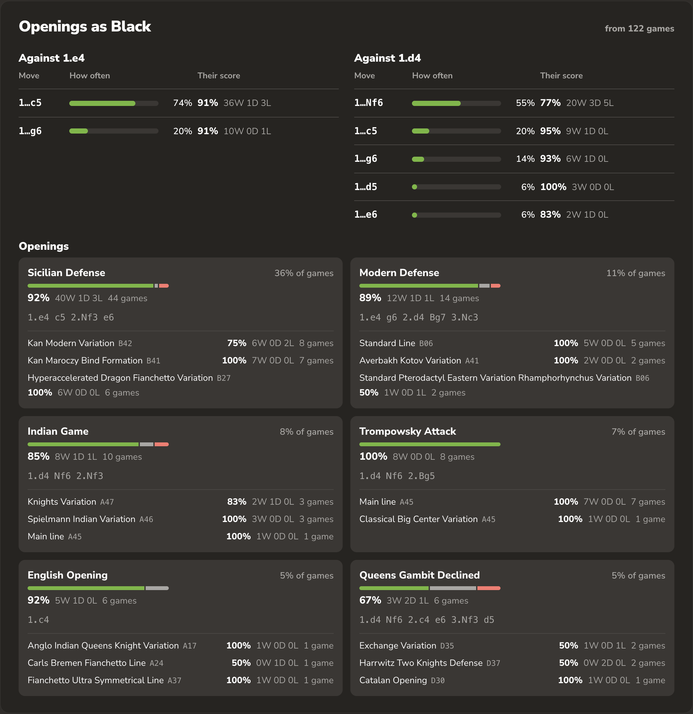</td>
    <td width="50%" valign="top">
      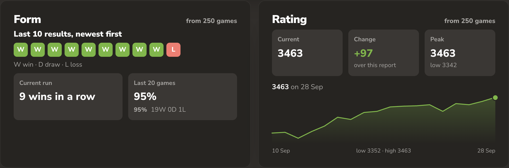
      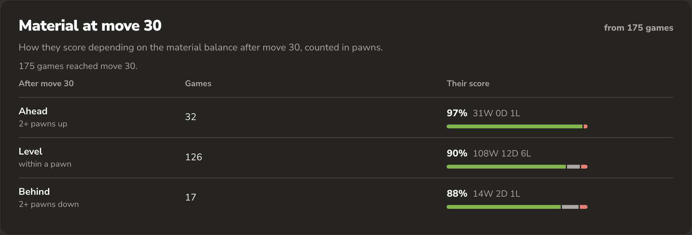
      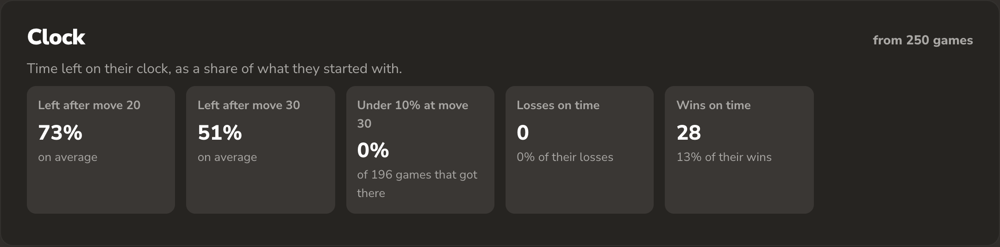
    </td>
  </tr>
</table>

| | |
| --- | --- |
| **Openings** | First moves as White, replies to 1.e4 and 1.d4 as Black, the six opening families they play most, each with a score and typical line |
| **Clock** | Share of starting time left at moves 20 and 30, how often they end up under 10%, losses and wins on time |
| **Material at move 30** | How they score when two pawns up, level, or two pawns down |
| **Form and rating** | Last 10 results, current streak, rating trend for their main pool |
| **Habits** | Game length, how games end, castling side, and when in the week they play |
| **Style** | Up to eight measured facts, e.g. *"Answers 1.e4 with 1...c5 in 74% of games (54 games)"* |
| **Game plan** | One sentence: what to expect in the opening, plus the single biggest edge to play for |

## Works on phones, too

<p align="center">
  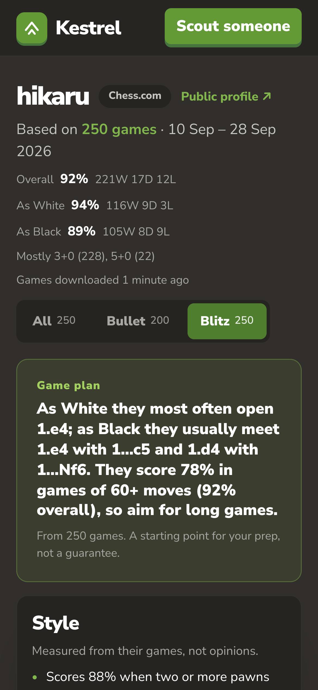
  &nbsp;&nbsp;&nbsp;
  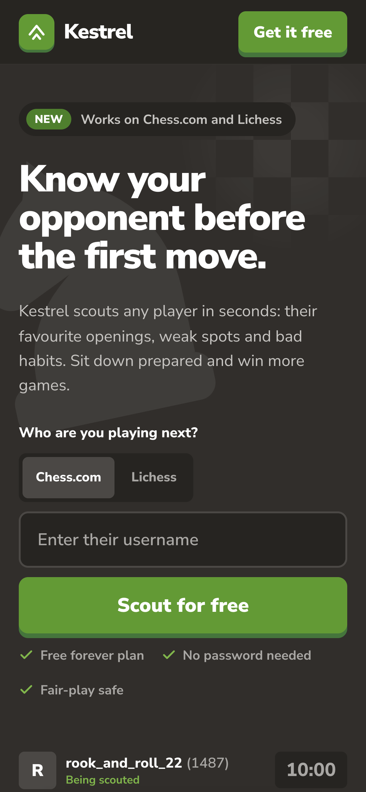
</p>

## Chrome extension

A **Scout with Kestrel** button on every Chess.com and Lichess profile, and a toolbar popup for anyone else. It locks itself whenever any tab has a game open.

<p align="center">
  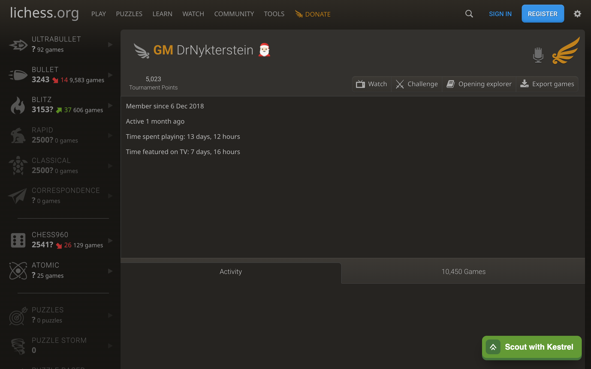
  &nbsp;
  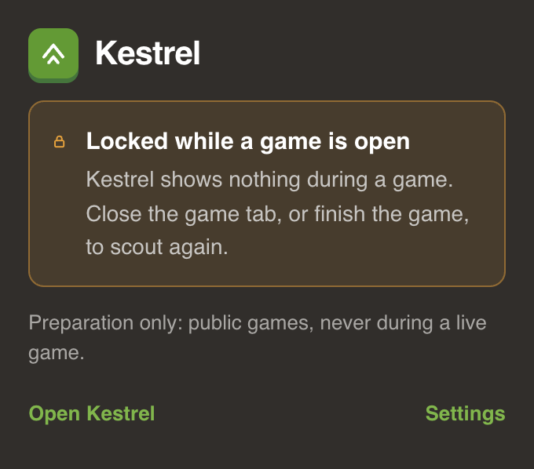
</p>

More in [docs/extension.md](docs/extension.md).

## Fair play

Kestrel is built around four rules that the code enforces rather than just documents.

1. **Nothing during a live game.** The extension only loads on profile pages, locks while any game tab is open, and re-checks before opening a report.
2. **Polite fetching.** One request at a time to Chess.com and Lichess, from a single worker that holds a database lock, with a User-Agent that includes a contact email. A `429` pauses the whole queue. No proxies, no scraping.
3. **Public data only.** No passwords, ever. Players who ask to be removed are never fetched or shown again.
4. **Honest reports.** Every figure shows its sample size. Style lines are facts ("castles queenside in 40% of games"), never judgements, and a test fails if a judgement word gets into a real report.

## How it works

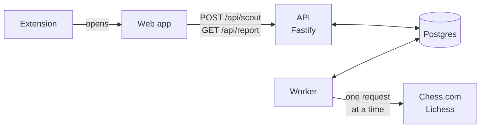

The API only reads the database and adds jobs to a queue. A single worker claims one job at a time, downloads the games (using ETags so finished months are never downloaded twice), stores them as compact rows of about 1 KB each, and rebuilds that player's reports. The web app polls until the report is ready.

The report engine is a pure function in [`packages/shared`](packages/shared/src/report). Moves and clocks are read from the PGN with regex instead of replaying every game, which is about 500 times faster. The one thing that does need a board, material at move 30, is worked out once when a game is stored.

| | |
| --- | --- |
| [Architecture](docs/architecture.md) | Packages, request flow, the worker, data model and deployment |
| [Report engine](docs/report-engine.md) | Every section, the thresholds, and how the game plan is chosen |
| [API](docs/api.md) | Routes, statuses and example responses |
| [Development](docs/development.md) | Running locally, tests, fixtures, migrations, env vars |
| [Extension](docs/extension.md) | The live-game lock, permissions, loading it unpacked |

## Stack

| Layer | Choice |
| --- | --- |
| Language | TypeScript across the board, npm workspaces |
| API | Fastify 5 |
| Worker | Plain Node, strictly serial loop, Postgres-backed queue |
| Database | Postgres 16, hand-written SQL migrations |
| Web | React 18 + Vite, no router or chart library |
| Extension | Chrome Manifest V3, plain JS |
| Chess | Regex PGN parsing, chess.js for material at move 30 |
| Tests | Vitest, 237 tests, real games as fixtures, fake `fetch` |
| Hosting | One Hetzner box running Docker Compose, Cloudflare in front, nightly backups to R2 |

## Quick start

```bash
cp .env.example .env        # set a password and your real contact email
docker compose up --build -d
open http://localhost:3000
```

That starts Postgres, runs the migrations, and brings up the API (which also serves the web app) and the worker. See [docs/development.md](docs/development.md) for running the pieces separately.

## Project layout

```text
packages/
  shared/      parsers, report engine, API types
  db/          migrations, queue, storage, fetch lock
  api/         Fastify server
  worker/      fetch loop and CLI scripts
  web/         landing page and report pages
  extension/   Chrome extension
docs/          architecture, API, report engine, screenshots
```

## Status

The fetching, report engine, web app and extension all work end to end against live Chess.com and Lichess data. Accounts and payments, the legal pages and the production deploy are next.

---

<p align="center">
  <sub>Not affiliated with Chess.com or Lichess. Uses public game data only.</sub>
</p>
