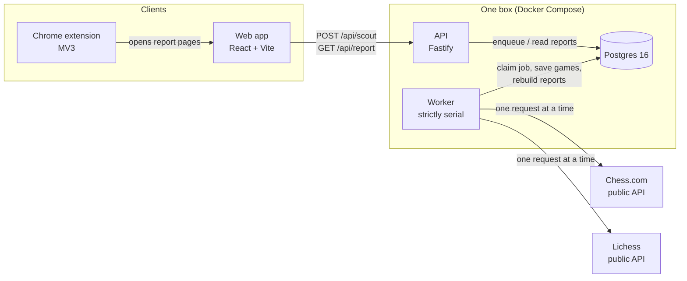
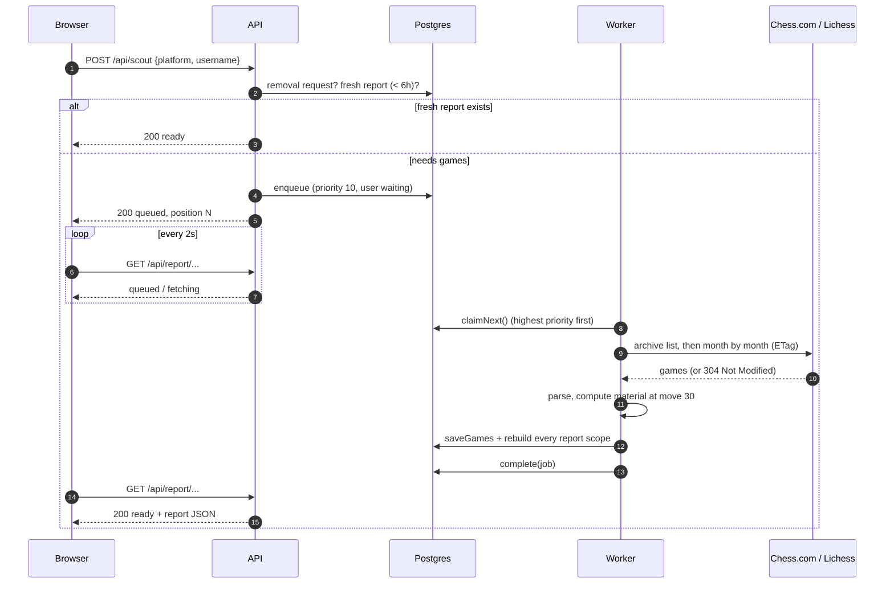
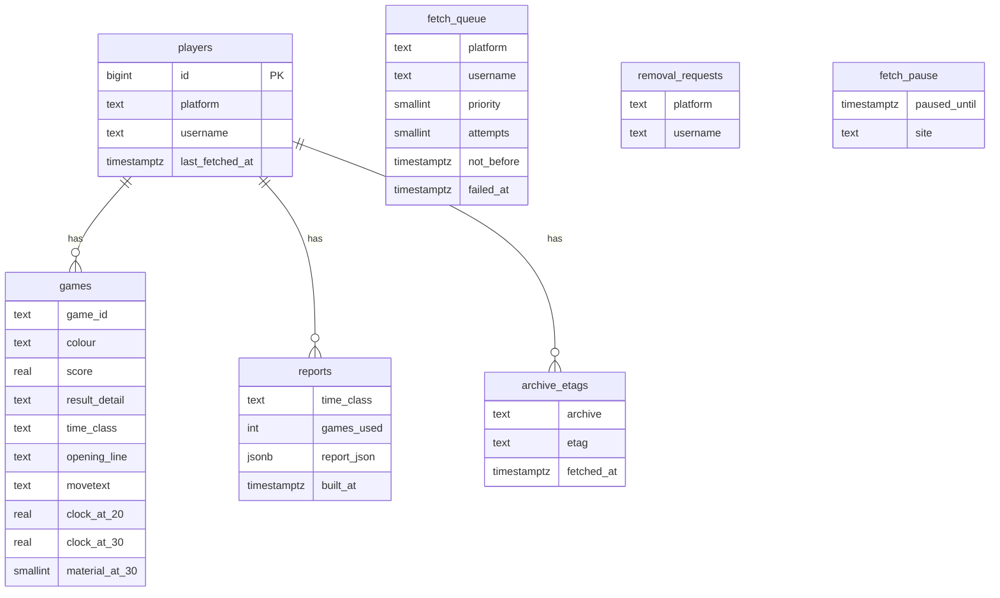
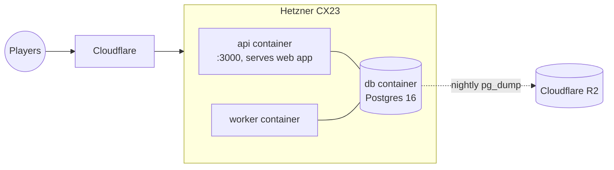

# Architecture

Kestrel is a small TypeScript monorepo: one Postgres database, one API process, one worker process, a React web app and a Chrome extension. Everything runs from a single Docker image.

## The big picture

The API never talks to Chess.com or Lichess. It only reads the database and adds jobs to `fetch_queue`. The worker is the only thing that makes outbound requests, and it makes them one at a time.

## Packages

| Package | What lives there |
| --- | --- |
| [`shared`](../packages/shared) | Config, User-Agent, the Chess.com and Lichess game parsers, the report engine and the API contract types |
| [`db`](../packages/db) | `pg` pool, numbered SQL migrations, the fetch queue, game storage, cached reports, the fetch lock |
| [`api`](../packages/api) | Fastify server: `/health`, `POST /api/scout`, `GET /api/report/...`; serves the built web app in production |
| [`worker`](../packages/worker) | The fetch loop plus CLI scripts (`scout`, `remove`, `backfill`, `fixture`) |
| [`web`](../packages/web) | Landing page and report pages, no router or chart library |
| [`extension`](../packages/extension) | Scout button on profile pages, toolbar popup, the live-game lock |

Workspace packages export `src` under the `development` condition (picked up by `tsx` and Vitest) and `dist` otherwise, so there is no build step while developing.

## What happens when someone scouts a player

## The worker

The worker loop ([`loop.ts`](../packages/worker/src/loop.ts)) runs one tick at a time and never overlaps them. Each tick claims at most one job.

- **One fetcher, ever.** On start-up the worker takes a Postgres advisory lock ([`fetchLock.ts`](../packages/db/src/fetchLock.ts)). A second worker started by mistake just waits. If the lock's connection drops, the worker exits and Docker restarts it.
- **Priorities.** Jobs for a user who is waiting on the page get priority 10. Background refreshes get 0.
- **Chess.com.** Newest month first, until it has 300 games or has gone back 12 months. A month downloaded after it finished is never asked for again. The current month is re-checked with its ETag, so an unchanged month costs a `304`.
- **Lichess.** The latest 300 games the first time, then only games since the newest one stored (`since=`).
- **Rate limits.** A `429` pauses the whole queue for at least a minute. The pause is stored in `fetch_pause`, so a restart doesn't cut it short.
- **Failures.** Retries after 30 s, 2 min, 8 min and 32 min, then gives up. The job stays in `fetch_queue` with `failed_at` and `last_error`, and queueing the player again starts it fresh.
- **Removals.** Players in `removal_requests` are never queued, fetched or shown. A removal that lands mid-fetch stops the job and deletes what it stored.

Every request carries the same User-Agent: `kestrel/<version> (contact: <email>)`. The worker refuses to start with the placeholder email from `.env.example`.

## Data model

Games are stored as compact rows (about 1 KB each), not the raw JSON. Reports are cached as JSON, one row per scope (`all`, `bullet`, `blitz`, `rapid`, `daily`), and the JSON carries a `REPORT_VERSION`. When the engine changes, older reports are rebuilt from stored games the next time someone reads them, so an upgrade never needs a refetch.

Migrations live in [`packages/db/migrations`](../packages/db/migrations) as numbered SQL files. They're applied in order inside a transaction each, under an advisory lock so two containers starting together can't race.

## Deployment

One image, three long-running containers and a one-shot `migrate` container that must finish before the API and worker start. Postgres is bound to `127.0.0.1` only. Behind Cloudflare, set `TRUST_PROXY=true` so the rate limit sees each visitor's real address.

This setup costs about £5.40 a month. The plan is to move to managed Postgres only once revenue justifies it.
