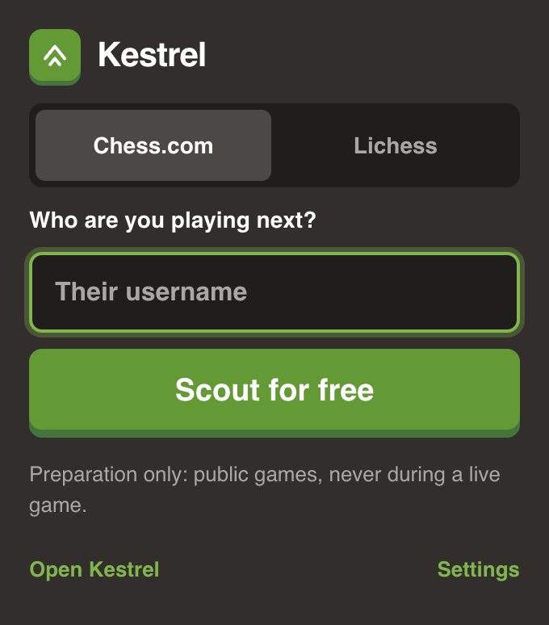

# Chrome extension

A Manifest V3 extension that adds a **Scout with Kestrel** button to Chess.com and Lichess profile pages, plus a toolbar popup for searching any player. Reports open on the Kestrel site in a new tab.

<p align="center">
  
</p>

<p align="center">
  
  &nbsp;&nbsp;
  
</p>

## The live-game lock

Kestrel is for preparation before a game and review after it. It must never help during one. The extension enforces that in a few layers:

1. **It only loads on profile pages.** The content script's `matches` are `chess.com/member/*` and `lichess.org/@/*`. It never runs on a game page.
2. **It locks while any game is open.** The background worker watches every Chess.com and Lichess tab. If any of them is on a game page (Chess.com `/game`, `/play`, `/live`, Lichess game ids, arenas, TV, the create-a-game dialogs), the Scout buttons disappear and the popup shows the locked message above.
3. **It re-checks before opening anything.** Even if a stale button is clicked, the background worker checks the lock again before it opens a report.
4. **When in doubt, it's a game.** The URL rules in [`lib.js`](../packages/extension/src/lib.js) are deliberately broad.

Both sites change pages without a full reload, so the content script polls the URL and removes the button the moment you leave a profile.

## Permissions

- `storage`, to remember the lock state and the Kestrel address from Options.
- Host access to `chess.com` and `lichess.org` only, so it can see which of those tabs are on game pages.

It never reads games, moves or passwords, and it makes no network requests of its own.

One limitation: it can't see a Chess.com daily game you have running unless that game's page is open.

## Loading it while developing

The Kestrel site needs to be running on `:3000`.

1. Open `chrome://extensions` and turn on **Developer mode**.
2. Click **Load unpacked** and pick the `packages/extension` folder.
3. Pin Kestrel from the puzzle-piece menu, then visit a profile and press **Scout with Kestrel**.

After changing files, hit the reload arrow on Kestrel's card.

Options (right-click the icon) sets where reports open. The default is `http://localhost:3000`.

```bash
npm run package -w @kestrel/extension   # zip for the Chrome Web Store
npm run icons -w @kestrel/extension     # redraw the toolbar icons
```
