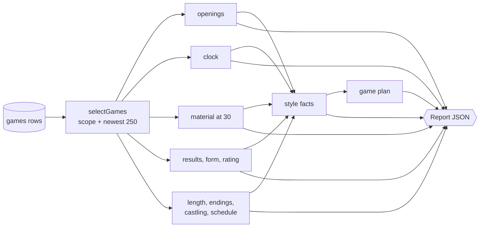

# The report engine

`buildReport(games, options)` in [`packages/shared/src/report`](../packages/shared/src/report) turns stored games into a scouting report. It's a pure function. Give it the same games and the same `now` and you get the same report, byte for byte. That makes it easy to test with exact numbers and cheap to rebuild whenever we like.

On Hikaru's 492 stored games it takes about **1.5 ms** per report on an Apple M4.

## Principles

**Every number shows its sample size.** Each section carries the number of games behind it, and the UI prints "from N games" on every card.

**Thin data says so.** A section with fewer than 10 games returns `{ enough: false, games, needed }` instead of guessing. The UI shows "not enough data".

**Facts, not judgements.** Style lines are measured statements like "Castles queenside in 40% of games (52 games)". Nothing like "aggressive" or "weak". A test in [`fixtures.test.ts`](../packages/shared/src/report/fixtures.test.ts) fails if a judgement word ever shows up in a real report.

**Recent games matter most.** A report uses at most the latest 250 games in the chosen time class.

## Sections

| Section | What it measures | Source |
| --- | --- | --- |
| Openings as White | First moves, top 6 opening families with score and typical line | [`openings.ts`](../packages/shared/src/report/openings.ts) |
| Openings as Black | Replies to 1.e4 and 1.d4, top families | [`openings.ts`](../packages/shared/src/report/openings.ts) |
| Clock | Share of starting time left after moves 20 and 30, losses and wins on time | [`clock.ts`](../packages/shared/src/report/clock.ts) |
| Material at move 30 | Score when two pawns up, level, or two pawns down | [`material-section.ts`](../packages/shared/src/report/material-section.ts) |
| Form | Last 10 results, current streak, last 20 games | [`results.ts`](../packages/shared/src/report/results.ts) |
| Rating | Trend for the most played rating pool, peak and low | [`results.ts`](../packages/shared/src/report/results.ts) |
| Opponents | Score against higher, similar and lower rated players (±50) | [`results.ts`](../packages/shared/src/report/results.ts) |
| Length, endings, castling | Short and long games, how games end, which way they castle | [`habits.ts`](../packages/shared/src/report/habits.ts) |
| Schedule | Games by hour and weekday (UTC, shifted to local time in the browser) | [`habits.ts`](../packages/shared/src/report/habits.ts) |
| Style | Up to 8 facts, strongest first | [`style.ts`](../packages/shared/src/report/style.ts) |
| Game plan | One sentence: what to expect, plus at most one edge | [`plan.ts`](../packages/shared/src/report/plan.ts) |

## Some details worth knowing

**Parsing is regex, not replays.** Moves and clocks come out of the PGN with a couple of regexes ([`pgn.ts`](../packages/shared/src/pgn.ts)). A full chess.js replay is roughly 500 times slower, which adds up over hundreds of games.

**Material at move 30 is the exception.** It needs a real board, so the worker replays each game once with chess.js when it stores it and saves the answer in `games.material_at_30`. The report engine only reads that number.

**Opening families.** Lichess names separate the family with a colon ("Sicilian Defense: Najdorf Variation"). Chess.com names don't, so the engine cuts after the first keyword (Defense, Opening, Game, Attack, Gambit, System), keeping a trailing "Declined" or "Accepted". That way the Najdorf and the Kan both count towards "Sicilian Defense".

**Clocks are shares, not seconds.** 30 seconds left means different things in 1+0 and 5+0, so clock readings are stored as a share of the starting clock. The starting clock is the one they really had: a Lichess arena player who berserks starts with half.

**Rating pools.** Lichess folds UltraBullet into bullet and Classical into rapid for our time classes, but they're separate ratings. The rating chart only plots the pool played most, and says how many games from other pools were left out.

**Style fact ranking.** Each fact has a threshold, for example "plays one first move in at least 50% of White games". Its strength is how far past the threshold it is, as a share of the room left. A 90% first move against a 50% threshold scores 0.8. Ties go to the fact with more games, then alphabetically, so the order is stable.

**The game plan.** The plan picks the opening sentence that fits in 220 characters, then adds the single strongest edge among clock trouble, flagging, failing to convert when ahead, scoring worse in level positions, or scoring worse in long games. If nothing crosses its threshold it says "No clear weakness found in N games" and suggests solid chess. Doing worse against higher-rated players is never an edge, since everyone does.

## Versioning

`REPORT_VERSION` in [`types.ts`](../packages/shared/src/report/types.ts) goes up whenever the shape or the maths changes. The API rebuilds any cached report with an older version the next time it's read, and `npm run backfill` rebuilds them all at once.
